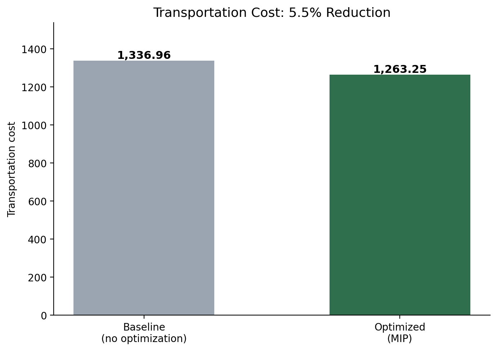
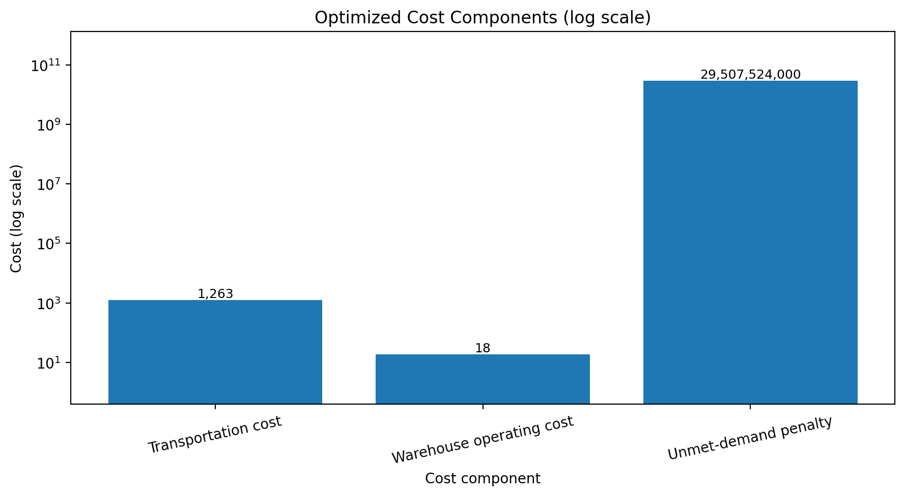
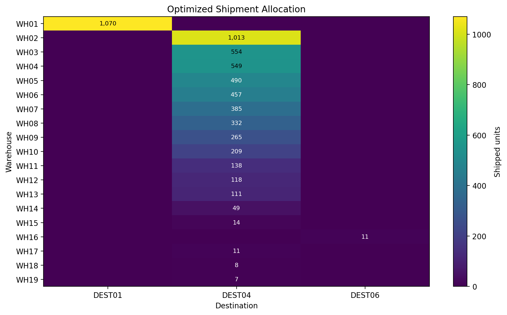

# Supply Chain Logistics Network Optimization using Mixed-Integer Programming


A mixed-integer programming model that decides which warehouses to operate and how
much to ship on each warehouse-to-destination lane, minimizing transportation cost,
warehouse operating cost, and the penalty on demand that cannot be served.

Built in Python with Gurobi. Originally developed as the final project for
IND E 570 (Supply Chain Analytics) at the University of Washington, then rebuilt
here as a modular, reproducible package running on synthetic data.



---

## The problem

Nineteen warehouses serve seven destinations, each warehouse with its own operating
cost and daily shipping capacity. The model is a decision-support tool for five
questions:

- Which warehouses should operate?
- How should limited inventory be allocated across them?
- Which shipment lanes minimize transportation cost?
- How should unavoidable shortages be distributed across destinations?
- What is the minimum achievable logistics cost?

The dataset has one property that shapes every answer: **total demand (29,513,315
units) exceeds total daily capacity (5,791 units) by roughly three orders of
magnitude.** Capacity is 0.02% of demand.

No plan can satisfy this demand. Rather than treat that as infeasibility, the model
admits an unfulfilled-demand variable and prices it, which changes the question from
*"can we serve everything?"* to *"given that we cannot, which lanes should the scarce
units travel on?"*

That reframing is the point of the project. It also means the interesting decision is
routing, not facility selection — every warehouse runs flat out in any sensible
solution.

## Model

**Decision variables**

| Variable | Type | Meaning |
|---|---|---|
| `shipment[w,d]` | Integer | Units shipped from warehouse `w` to destination `d` |
| `warehouse_open[w]` | Binary | Whether warehouse `w` operates |
| `unmet_demand[d]` | Continuous | Demand at `d` that goes unserved |

**Objective** — minimize

```
Σ transport_cost[w,d] · shipment[w,d]      transportation
+ Σ fixed_cost[w] · warehouse_open[w]        operating
+ Σ penalty · unmet_demand[d]                shortfall
```

**Constraints**

1. **Demand balance** — for each destination, units received plus unmet demand equals demand.
2. **Capacity linked to activation** — a warehouse ships at most its capacity, and only if open.

Non-negativity is enforced through variable bounds rather than explicit constraints.

Model size: **159 variables** (133 shipment + 19 binary + 7 shortfall), 26 constraints.
Gurobi solves it to a 0.00% gap in under a hundredth of a second.

## Results

| Scenario | Transportation cost |
|---|---|
| Baseline — allocate without regard to cost | 1,336.96 |
| Optimized — MIP routing | 1,263.25 |
| **Reduction** | **5.5%** |

The baseline in `src/baseline.py` is the allocation a planner would produce without an
optimizer: work through destinations in order and fill each from whichever warehouse
still has capacity. It consumes capacity identically to the optimized solution — same
units shipped, same warehouses open — so the comparison isolates the value of the
routing decision alone.

**Cost composition of the optimized solution**

| Component | Value |
|---|---|
| Transportation | 1,263.25 |
| Warehouse operating | 18.40 |
| Unmet-demand penalty | 29,507,524,000 |

The penalty dominates the objective by seven orders of magnitude, but it is effectively
a constant: the shortfall is fixed by the capacity gap, not by any decision the model
makes. Optimization operates entirely on the 1,263 of transportation cost. Reporting
a percentage against the total objective would be meaningless, which is why the headline
figure is transportation cost specifically.



**Where the units go**

All 19 warehouses ship at full capacity, and 99.98% of demand goes unserved. The solver
concentrates shipments on the destinations reachable by the cheapest lanes rather than
spreading them proportionally across demand.



## Data

The files in `data/` are **synthetic**, generated by `data/generate_synthetic_data.py`.

The original coursework used the Supply Chain Logistics Problem Dataset
(Kalganova & Dzalbs, 2019, Brunel University London,
[doi.org/10.17633/rd.brunel.7558679](https://doi.org/10.17633/rd.brunel.7558679)),
which is not redistributed here. The generator reproduces the structural features that
drive the result — the capacity shortfall, the concentration of demand, and the fact
that most lane costs are imputed rather than observed. On the original data the model
achieved a 5.6% transportation cost reduction; on the synthetic substitute it achieves
5.5%.

See [`data/README.md`](data/README.md) for the full comparison and file schemas.

## Running it

```bash
pip install -r requirements.txt

python data/generate_synthetic_data.py   # optional; CSVs are committed
cd src && python main.py
```

Gurobi's pip package includes a free restricted license capped at 2,000 variables. This
model uses 159, so no academic or commercial license is required.

Outputs land in `results/`: four CSVs (shipments, unmet demand, cost summary, baseline
comparison) and four figures.

## Repository layout

```
├── data/
│   ├── README.md                     dataset provenance and schemas
│   ├── generate_synthetic_data.py    deterministic generator (seed 570)
│   └── *.csv                         demand, capacity, fixed cost, lane cost
├── src/
│   ├── data_processing.py            load and validate inputs
│   ├── optimization_model.py         build and solve the MIP
│   ├── baseline.py                   naive allocation for comparison
│   ├── visualization.py              figures
│   └── main.py                       pipeline entry point
└── results/                          CSVs and figures
```

`data_processing.py` validates before solving — it checks for duplicate keys, negative
values, missing fixed costs, and incomplete lane coverage, and fails with a specific
message rather than letting a malformed input reach the solver.

## Limitations

- **Lane costs are largely imputed.** Most warehouse-destination pairs carry a single
  shared rate because the source data prices only a handful of lanes. Real distance-based
  costs would change the routing and likely increase the achievable saving.
- **Single period, deterministic demand.** No seasonality, variability, lead times, or
  inventory carried between periods.
- **The penalty weight is a modeling choice**, not a measured stockout cost. Results
  should be checked for sensitivity to it.
- **Capacity is treated as a hard daily limit** with no overtime or surge options.

## Possible extensions

Multi-period demand with inventory; stochastic demand and disruption scenarios; a
multi-objective formulation trading cost against service level or emissions; and real
distance-based lane costs to replace the imputation.

## License

Code is released under the terms in [LICENSE](LICENSE). The synthetic data is generated
by this repository and carries no third-party restrictions; the original dataset it
imitates is licensed separately by its publisher.
